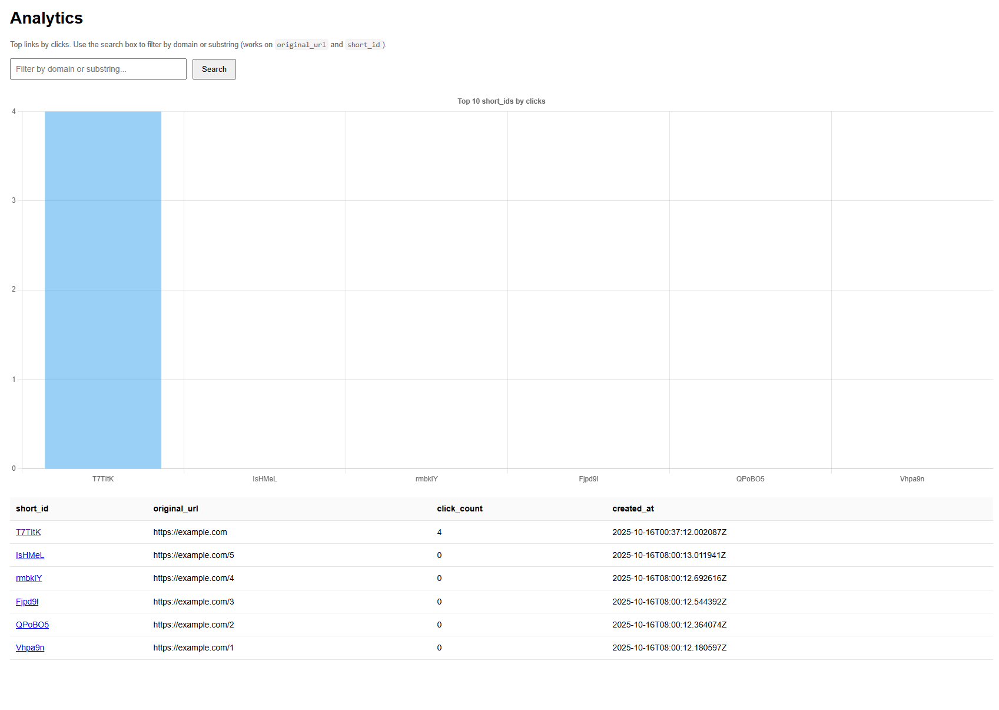

# 🔗 URL Shortener API  


A lightweight **Flask + SQLite/PostgreSQL** service that converts long URLs into short, trackable links — now with validation, rate limiting, and analytics dashboard.

---

## 🚀 Key Features

- ✨ **Shorten long URLs instantly**  
- 🔁 **Redirect via** `/short_id`  
- 🧠 **Duplicate detection** — prevents duplicate entries  
- ✅ **Validation** using `urllib.parse`  
- ⚡ **Rate limiting** (5 requests/min per IP) with Flask-Limiter  
- 📊 **Analytics dashboard** — view click counts & creation time  
- 🔍 **Search filter (`?q=`)** on `/analytics`  
- 💾 **SQLite (local)** or **PostgreSQL (Render/Cloud)**  
- 🌐 Minimal **HTML form** for manual testing  
- 🔧 **CI workflow** — lint & test automation via GitHub Actions  

---

## 🧩 Tech Stack

| Layer | Technology |
|-------|-------------|
| Backend | Flask 3.x |
| Database | SQLite (default) / PostgreSQL |
| ORM | SQLAlchemy |
| Config | python-dotenv |
| Rate Limit | Flask-Limiter |
| Testing | Pytest |
| CI | GitHub Actions (Ruff + Pytest) |
| Language | Python 3.12 |

---

## ⚙️ Quick Setup (Local)

### 1️⃣ Clone & Create Virtual Environment
```bash
git clone https://github.com/<yourusername>/url-shortner-api.git
cd url-shortner-api

# Windows
py -m venv .venv && .\.venv\Scripts\activate

# macOS/Linux
python3 -m venv .venv && source .venv/bin/activate
```

### 2️⃣ Install Dependencies
```bash
pip install -r requirements.txt
```

### 3️⃣ Configure Environment
```bash
cp .env.example .env
```

Edit `.env`:
```
FLASK_ENV=development
SECRET_KEY=your-secret-key
DATABASE_URL=sqlite:///database.db
```

### 4️⃣ Initialize Database
```bash
py
>>> from app import create_app
>>> from app.models import db
>>> app = create_app()
>>> with app.app_context():
...     db.create_all()
...     exit()
```

### 5️⃣ Run the App
```bash
py main.py
```

Open: [http://127.0.0.1:5000](http://127.0.0.1:5000)

---

## 📊 Analytics Dashboard

Route: [`/analytics`](http://127.0.0.1:5000/analytics)

- Displays all short URLs (sorted by click count)
- Built using **Jinja2** + **Chart.js (CDN)**
- Supports `?q=` query for domain/keyword filter  
  Example:  
  ```
  /analytics?q=example.com
  ```



---

## 🧪 API Endpoints

| Method | Endpoint | Description |
|---------|-----------|-------------|
| `POST` | `/shorten` | Create a short URL |
| `GET` | `/<short_id>` | Redirect to original URL |
| `GET` | `/all` | List all short URLs |
| `GET` | `/stats/<short_id>` | Fetch click count for one link |
| `GET` | `/analytics` | HTML analytics dashboard |
| `GET` | `/api/analytics` | JSON version of analytics |

---

## 🧾 Example Requests

### ➕ Shorten a URL
```bash
curl -X POST http://127.0.0.1:5000/shorten      -H "Content-Type: application/json"      -d '{"url":"https://example.com"}'
```

**Response**
```json
{
  "short_id": "Ab3xYz",
  "short_url": "http://127.0.0.1:5000/Ab3xYz",
  "original_url": "https://example.com"
}
```

### 📊 View Analytics (JSON)
```
GET http://127.0.0.1:5000/api/analytics
```

---

## 🧠 Testing

Run the test suite:
```bash
pytest -q
```

Run lint check:
```bash
ruff check .
```
---

## 📜 License

[MIT License](LICENSE)

---

## 👩‍💻 Author

**Priyanka Jawalkar**  
Master’s in Computer Science  
💻 [GitHub](https://github.com/PriyaJ31)
